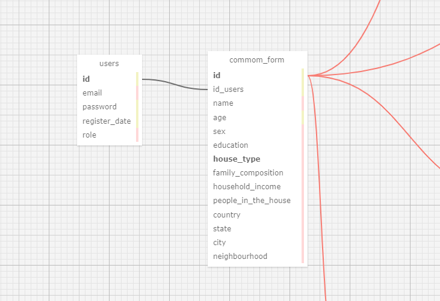
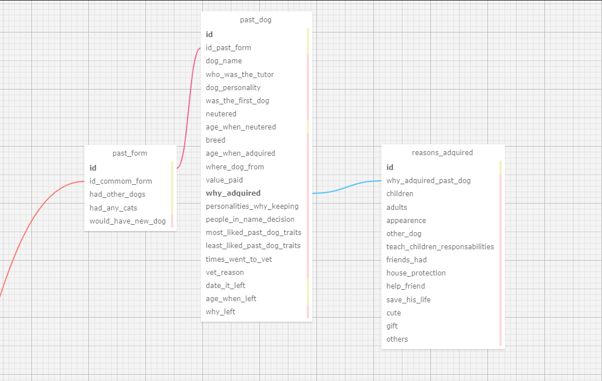
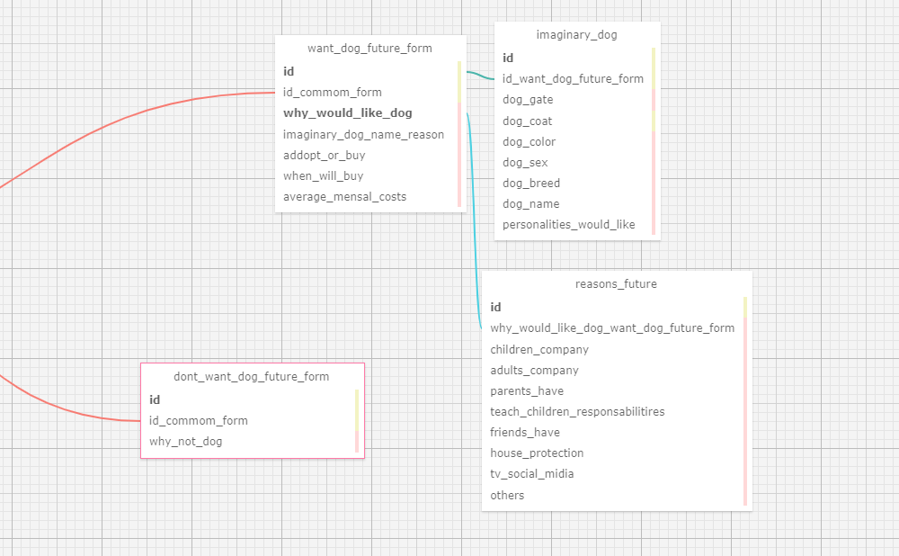
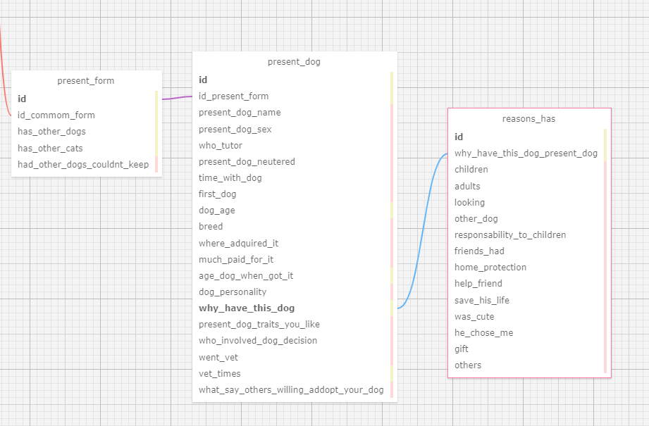

## Documentação do Modelo Relacional

**Projeto:** Abandono Zero

**Data:** 2024-05-08

**Autor:** Davi Abreu da Silveira

**Objetivo:** Descrever o modelo relacional do projeto de forma resumida e simplificada.

## Introdução

Este documento descreve o modelo relacional simplificado para o projeto Abandono Zero, que visa coletar e gerenciar informações sobre usuários e suas relações com cães para analisar esses dados e poder ter base para um estudo sobre o abandono de cães.

## Prints

## Entidades

- **Usuários** (`users`): Armazena informações básicas sobre os usuários (email, senha, data de registro, cargo).
- **Formulário Comum** (`commom_form`): Detalhes comuns do usuário que responde ao formulário (nome, idade, sexo, educação, tipo de moradia, composição familiar, renda familiar, número de pessoas na casa, país, estado, cidade, bairro).
- **Formulário de usuário que quer ter cães** (`want_dog_future_form`): Informações gerais sobre o usuário que quer um cão no futuro (características imaginárias do cão desejado, razões para querer um cão, preferência entre adotar ou comprar, previsão de compra, preferência de personalidade do cão, custos mensais médios estimados).
- **Características do cão imaginário** (`imaginary_dog`): Características imaginárias do cão que o usuário deseja ter no futuro (ligado ao formulário de querer ter cães).
- **Razões de querer ter cães futuros** (`reasons_future`): Motivos pelos quais o usuário deseja ter um cão no futuro (ligado ao formulário de querer ter cães).
- **Formulário usuário que não quer ter um cão** (`dont_want_dog_future_form`): Razões do usuário para não querer um cão no futuro.
- **Formulário de usuário que têm cães** (`present_form`): Informações sobre o usuário que têm cães (possui outros cães, possui outros gatos, razões para ter ou não poder manter um cão atualmente, caso existam).
- **Formulário com informações do cão de usuário que possui cão** (`present_dog`): Informações sobre o cão atual do usuário (nome do cão, sexo do cão, tutor, se foi castrado, tempo com o cão, se é o primeiro cão, raça, origem do cão, valor pago, idade do cão ao ser adquirido, personalidade do cão, razões para ter o cão, características do cão que o tutor gosta, pessoas envolvidas na decisão de ter o cão, visitas ao veterinário, número de vezes que foi ao veterinário, se outras pessoas estariam dispostas a adotar o cão).
- **razões de ter cães** (`reasons_has`): Motivos pelos quais o usuário possui um cão atualmente (ligado ao formulário de cão presente).
- **Formulário de informações do usuário que já teve cães** (`past_form`): Informações sobre o usuário que em seu histórico já teve outro(s) cães (já teve outros cães, já teve outros gatos, gostaria de ter um novo cão).
- **Formulário com Informações do cão do usuário que já teve cães** (`past_dog`): Informações sobre os cães anteriores do usuário (nome do cão, tutor, personalidade do cão, se foi o primeiro cão, se foi castrado, idade na castração, raça, idade quando adquirido, origem do cão, valor pago, motivo da aquisição, personalidades que mais gostava e menos gostava, visitas ao veterinário, razões das visitas ao veterinário, data de saída, idade na saída, motivo da saída).
- **Razões de ter adotado/comprado um cão** (`reasons_adquired`): Motivos pelos quais o usuário adquiriu um cão anteriormente (ligado ao formulário de cão passado).

## Relacionamentos

- Um usuário pode ter um único formulário comum (1:1).
- Cada formulário específico (futuro, passado e presente) está associado a um formulário comum (1:1).
- Um usuário pode ter vários formulários relacionados a cães (1:N).
- Cada formulário de cão está associado a um formulário específico (1:1), como past_form, present_form e want_dog_future_form
- Cada razão de adoção/compra de cães (reasons_adquired, reasons_future, reasons_has) está associada a um cão anterior do usuário (1:1).

## Regras de Negócio

- Todos os campos obrigatórios devem ser preenchidos.
- As informações devem ser consistentes entre os formulários.
- Os usuários não podem editar informações já salvas, exceto em casos específicos.
- As informações dos usuários são confidenciais.

## Considerações Finais

Este modelo relacional simplificado oferece uma estrutura clara e organizada para gerenciar as informações dos usuários e suas relações com cães no projeto Abandono Zero. É importante seguir as boas práticas de desenvolvimento de banco de dados durante a implementação deste modelo para garantir a integridade e a confiabilidade dos dados.

**Observações:**

- Este modelo é uma versão simplificada e pode ser adaptado às necessidades específicas do projeto.
- É importante documentar detalhadamente o modelo relacional para facilitar o entendimento e a manutenção do sistema.
- A implementação do modelo relacional deve seguir boas práticas de desenvolvimento de banco de dados.